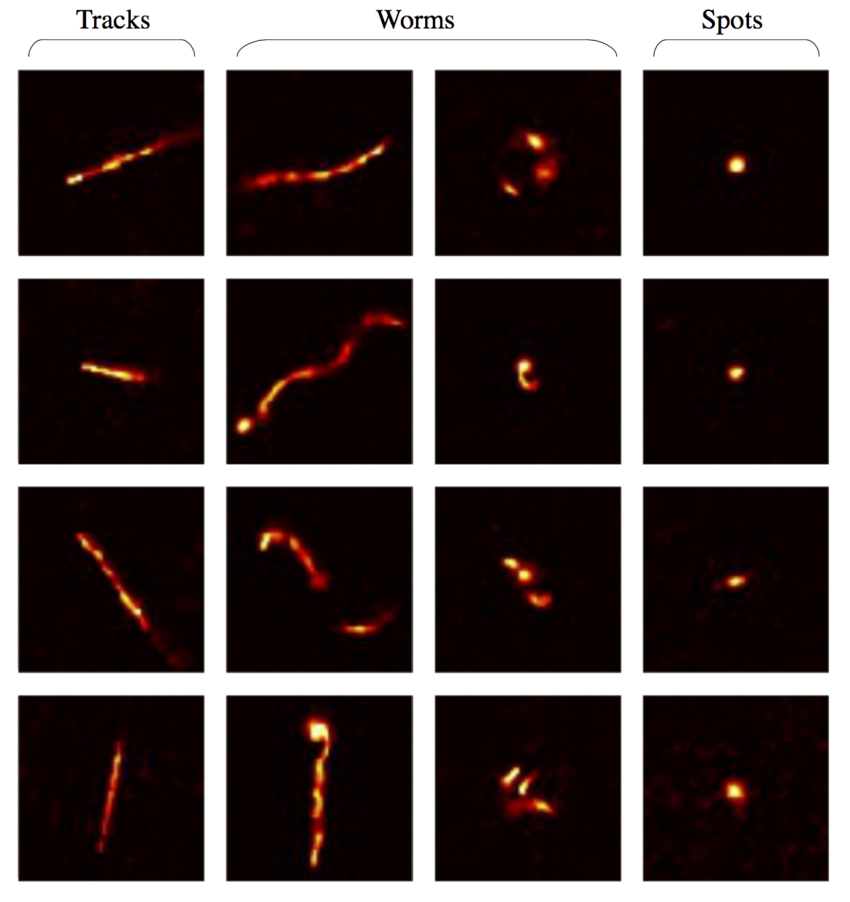
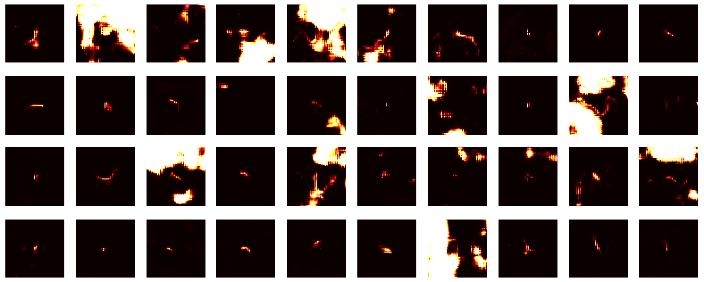
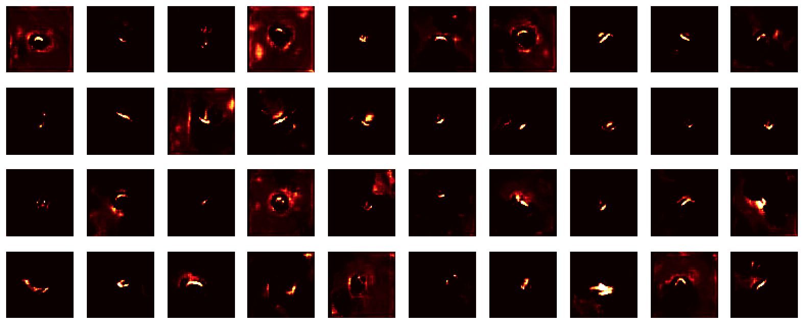
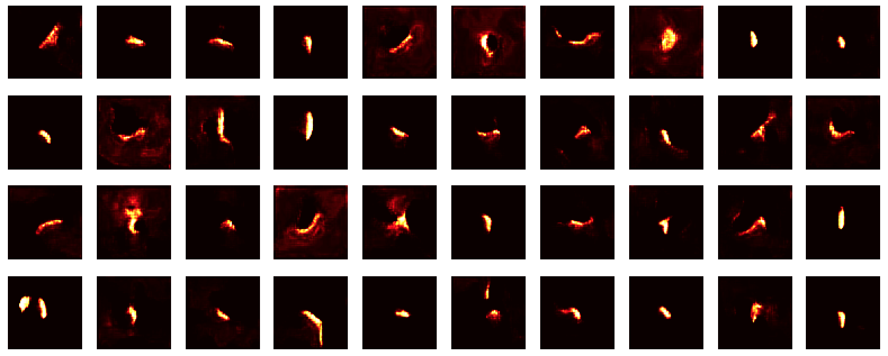
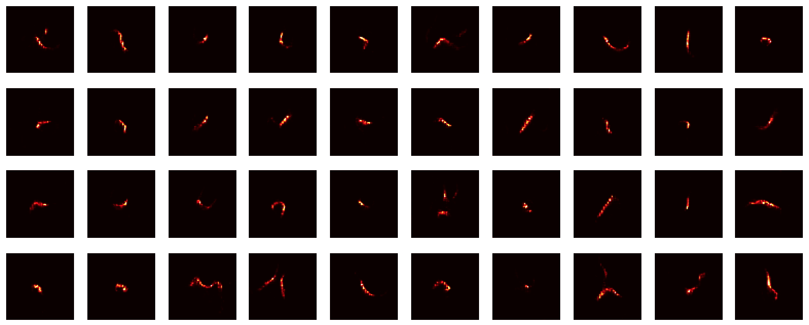
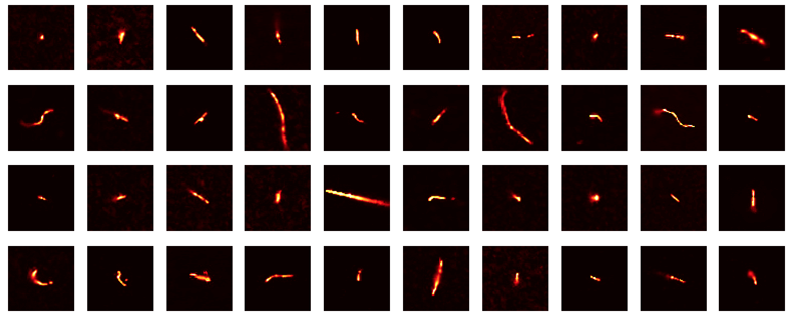

# DECO_DCGAN
Construct a DCGAN in TFLearn and use data augmentation to test if the generative model can learn to produce images with rotation-invariant features. 

## DECO
DECO is a citizen science project that enables users around the world to detect cosmic rays and other energetic particles with their cell phones and tablets. Cosmic rays are energetic subatomic particles produced by powerful cosmic accelerators, such as black holes and exploding stars. When a cosmic-ray muon hits the camera sensor, it liberates some electrons. The accumulated charge tells us about the amount of energy particle deposited, while the distribution of this charge in our sensor, the shape, tells us about the kind of particle that has produced it. Learn more about DECO [here](https://wipac.wisc.edu/deco/home)

DECO detects three distinct types of particle physics events: tracks, worms, and spot. Shown below are zoomed-in images of what each event type looks like in the camera sensor. The orientation of the physics event with respect to camera sensor is completely arbitrary, i.e. the way a DECO user orients their phone during data taking has no effect on the events themselves. As a result, all events are both translation and rotation invariant. 

## DCGAN
Deep Convolutional Generative Adversarial Networks (DCGAN) are unsupervised learning frameworks that learn general feature representations through an adversarial training process that involves both a generative and discriminative model. The trained generative model then takes a distrubution of random numbers and generates new image samples from the previously learned representations. For example, DCGAN has been used to generate images of human faces, hand-written digits, bed rooms, etc. See [Radford et al, 2016](https://arxiv.org/abs/1511.06434) for example. 

A critical difference between DECO events and human faces or bed rooms is the additional of rotation-invariant data. Let's see if we can use data augmentation to train a DCGAN to generate rotation-invariant images. 

## Analysis and Results
Because certain particle physics events can be somewhat rare, the DECO dataset only contains a few thousand images. In order to prevent the model from simply memorizing the training set, random rotations, x-y reflections, and blurring are used during the training process. This also should force the model to learn features that are approximately rotation-invariant. During training, sample images were periodically produced by the generative model:
## Snapshot 1

## Snapshot 2

## Snapshot 3

## After Training
Randomly Generated Images

Real Images (for comparison)

The generated images aren't perfect, but the model certainly appears to have learned the correct features and is producing images at a number of orientations. 
